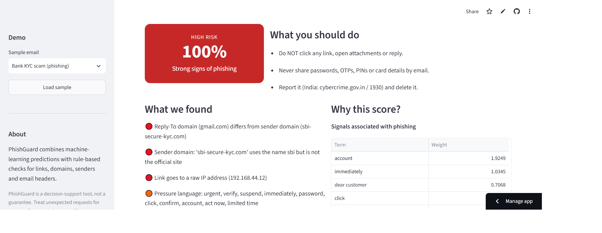
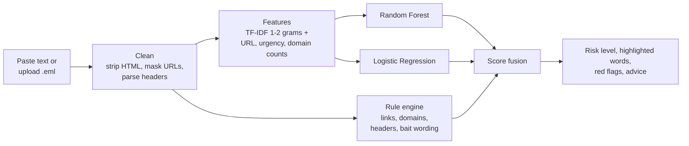

<div align="center">

# 🛡️ PhishGuard

**Explainable phishing email detection using NLP and rule-based checks**

[](https://phishguard2026.streamlit.app/)


[**Try the live demo →**](https://phishguard2026.streamlit.app/)

</div>

---

<p align="center">
  
</p>

## Why PhishGuard?

Polished phishing emails look genuine, and most spam filters never explain their decisions. PhishGuard gives you a verdict **and the reasons behind it**, so users learn what to look for and are less likely to click on fraud.

Paste an email or upload a `.eml` file and get:

- a **risk score** with a Low / Medium / High verdict
- the **exact words** that pushed the score towards phishing, highlighted in the email
- a **red-flag checklist** (lookalike domains, mismatched links, failed sender authentication and more)
- plain-language **advice** on what to do next
- a downloadable **report**

## Features

| | |
|---|---|
| **Hybrid engine** | A machine-learning text model combined with rule checks on sender, headers and URLs |
| **Explainable** | Per-email word contributions from Logistic Regression weights, highlighted in the message |
| **Header aware** | Reads SPF / DKIM / DMARC results and flags Reply-To mismatches from `.eml` files |
| **Lookalike detection** | Catches typo and leetspeak brand domains (e.g. `netfIix-billing.com`) and misleading link text |
| **India aware** | Knows Indian brands and scams (SBI, HDFC, Paytm, KYC, Aadhaar, OTP) and points to cybercrime.gov.in / 1930 |
| **Self-improving** | "This was phishing / legitimate" buttons save labelled emails that feed retraining |
| **Lightweight** | Open-source stack, CPU-only, no GPU or paid APIs |
| **Privacy first** | Emails are analysed in-session and saved only if the user submits feedback |

## How it works



**Score fusion.** The ML probability is the average of the Random Forest and Logistic Regression outputs. Each rule flag adds risk (a noisy-OR, so many small flags never add up to 100%). The two are combined as:

```
final = 1 - (1 - ml_probability) × (1 - rule_score)
```

If the sender passes authentication **and** is a known official domain, the ML score is down-weighted to cut false alarms. Very short, ordinary messages with no links or pressure language are also down-weighted. The final score maps to **LOW** (< 35%), **MEDIUM** (< 65%) or **HIGH**. PhishGuard never auto-blocks anything: it shows the probability and reasons and leaves the decision to the user.

### Rule checks

Reply-To domain differs from sender · SPF/DKIM/DMARC failure · lookalike brand in sender or link domain · links to raw IP addresses · URL shorteners · unencrypted `http` links · link text that shows one address but leads to another · prize / crypto bait wording · pressure language · requests for OTP, PIN, password, card number, KYC or Aadhaar

## Results

| Metric | Value |
|---|---|
| Random Forest accuracy (held-out 20% test set) | **98.5%** |
| Phishing recall | **98.8%** |

> **Honest note:** these numbers come from a public Kaggle dataset and may be inflated by dataset bias. Retesting on fresh real-world emails is in progress (see the roadmap). Treat PhishGuard as a decision-support tool, not a guarantee.

## Quick start

```bash
git clone https://github.com/0xdm0n3y/phishguard.git
cd phishguard

python -m venv .venv
source .venv/bin/activate # Linux
.venv\Scripts\activate.bat # Windows

pip install -r requirements.txt
streamlit run app.py
```

The trained `model.joblib` is included, so the app runs straight away. Use the **Demo** sidebar to load sample phishing and legitimate emails.

## Retraining the model
If you wanna train the model yourself, Use this sequence of commands:-
```
git clone https://github.com/0xdm0n3y/phishguard.git
cd phishguard

python -m venv .venv
source .venv/bin/activate
.venv\Scripts\activate.bat

pip install -r requirements.txt
python train_model.py --data combined_phishing_dataset.csv

# or use with feedback csv

python train_model.py --data combined_phishing_dataset.csv --feedback feedback.csv
streamlit run app.py
```

> The model is saved with scikit-learn `1.9.1`. If you train with a different version, update the pin in `requirements.txt` to match.

## Project structure

```
phishguard/
├── app.py              # Streamlit web app
├── phish_utils.py      # cleaning, features, rule engine, scoring, explanations
├── train_model.py      # trains and saves the models
├── demo_emails.py      # sample emails for the live demo
├── model.joblib        # trained TF-IDF + scaler + Random Forest + Logistic Regression
├── requirements.txt
└── .streamlit/         # app theme
```

## Limitations

- Trained mainly on English emails; Hindi/Hinglish support is on the roadmap.
- Public datasets can differ from today's real attacks, so accuracy on fresh emails may be lower.
- Attachments and images are not analysed.
- Free hosting means `feedback.csv` is not permanent on the live demo.

## Roadmap

- [x] **Phase 1:** baseline models trained and compared on Kaggle phishing data
- [x] **Phase 2:** web app with paste / `.eml` input, rule engine, red flags and feedback buttons
- [ ] **Phase 3 (in progress):** retest on fresh real emails, retrain with user feedback, publish limits and false-alarm rate
- [ ] **Phase 4:** labelled Hindi/Hinglish set, BERT upgrade and SHAP/LIME check, API plus Gmail / browser add-on

## References

- Kaggle: *Phishing Email Dataset*, N. A. Alam
- Kaggle: *Phishing and Legitimate Email Dataset for ML 2026*, Kuladeep19
- GitHub: *Phishing Pot*, rf-peixoto
- Breiman, L. "Random Forests", Machine Learning 45, 2001
- Ribeiro, Singh, Guestrin. "Why Should I Trust You?" (LIME), KDD 2016
- Lundberg and Lee. "A Unified Approach to Interpreting Model Predictions" (SHAP), NeurIPS 2017
- Devlin et al. "BERT: Pre-training of Deep Bidirectional Transformers", NAACL 2019
- APWG: Phishing Activity Trends Reports
- CERT-In: Indian Computer Emergency Response Team advisories

## License

Released under the [MIT License](LICENSE).

---

<sub>PhishGuard is a decision-support tool, not a guarantee. Treat unexpected requests for passwords, payments or sensitive information with caution.</sub>
